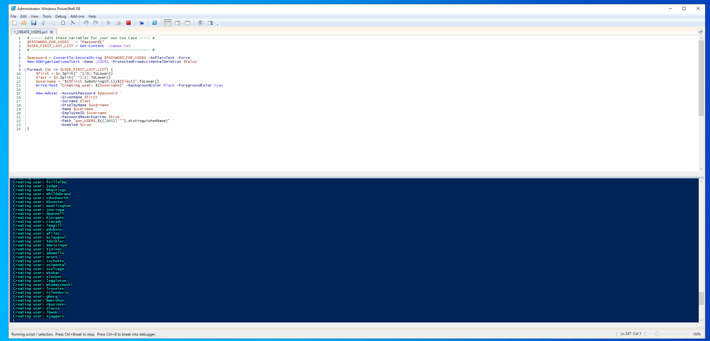

# Simulated Active Directory environment using Windows Server 2022 and VirtualBox.

## 💡 Overview
Simulated an Active Directory environment using Windows Server 2022 in VirtualBox. Configured core infrastructure components including DNS, DHCP, RRAS, Group Policy, and user provisioning automation using PowerShell.

## 🛠️ Steps Taken
* Promoted Windows 22 Server to Domain Controller.

* Configured a dual-NIC setup to separate internet access (NAT) from internal domain traffic using a private subnet (172.168.0.0/24), ensuring secure and isolated domain communication.

* Created an administrative OU and a user account, assigned the account Domain Admin rights. Updated credentials and performed a password reset.

* Configured Routing and Remote Access Service (RRAS) to provide NAT-based internet access for the internal network.

* Implemented DNS and DHCP services to facilitate domain name resolution and dynamic IP addressing within the internal network, including creating and configuring a DHCP scope. Enabled routing via RRAS to support network traffic flow.
  
* Automated user account creation by running a PowerShell script to import entries from a names.txt file into Active Directory, including initial password setup.

* Provisioned a Windows 11 virtual machine, joined it to the domain, and verified DNS functionality and network connectivity using command-line tools such as ping.

* Verified login and access of users created via script.

## 🧰 Tools Used
**VirtualBox** – Virtualization platform for hosting VMs
- **Windows Server 2022** – Domain Controller, DNS, DHCP, RRAS
- **Windows 11 Enterprise** – Domain-joined client
- **PowerShell** – Scripted user provisioning
- **Active Directory Users and Computers (ADUC)** – User and OU management
- **Routing and Remote Access Service (RRAS)** – NAT and routing configuration
- **Command-line tools** – `ping`, `nslookup`, `ipconfig`, `whoami` for testing

## 🧠 Skills Demonstrated
- Active Directory setup and domain controller promotion
- DHCP and DNS configuration for internal network services
- RRAS configuration for NAT and routing
- PowerShell scripting for automation of account creation (implementation)
- Network troubleshooting using command-line tools
- Virtualization and lab environment creation using VirtualBox
- OU and permission management in Active Directory

## 📸 Screenshots
**Both virtual machines:**

**Script to import users:**

**IP Address Leases list on DC with joined VM:**

**Diagram the Home Lab is based off of:**

